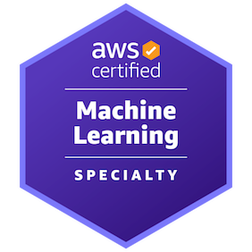

# 👋 Hi, I’m Rajat Jog

Senior Software Engineer • Full-Stack Architect • Python/Django Specialist  
I design **correct, scalable systems** where business logic, data integrity, and long-term maintainability actually matter.

---

  

## 🧠 How I Think

I approach software the way an architect approaches a city:

- **Correctness before cleverness**
- **Explicit models over implicit magic**
- **Deterministic systems over fragile heuristics**
- **Auditability, idempotency, and safety as first-class concerns**

I’m not interested in “just making it work.”  
I care about *why it works, when it breaks, and how it evolves*.

---

## 🛠 Core Stack

**Backend**
- Python, Django, Django REST Framework
- PostgreSQL (schema design, constraints, indexing)
- Background workers, idempotent jobs, transactional workflows

**Frontend**
- React, Next.js
- API-driven UI architecture
- Clean state management & predictable data flows

**Architecture & Infra**
- RESTful API design
- Role-based access control (RBAC)
- Audit logging, compliance-friendly systems
- Payments, booking engines, scheduling logic
- Scalable slot & recurrence modeling

---

## 🧩 What I’m Especially Good At

- Designing **complex domain models** (booking, payments, scheduling, healthcare workflows)
- Preventing edge-case failures *before* they happen
- Turning messy requirements into **clean, enforceable invariants**
- Building systems that are:
  - safe to regenerate
  - easy to reason about
  - hard to misuse

If a system involves **time, money, concurrency, or humans** — that’s my zone.

---

## 📦 Open Source & Side Projects

I enjoy extracting reusable ideas into libraries and frameworks:

- Scheduling & time-block systems with deterministic behavior
- Audit logging & compliance-friendly tooling
- Django/DRF utilities that reduce foot-guns for teams

My side projects usually start as solutions to real production pain — not toy demos.

---

## 🧪 Engineering Principles I Follow

- Explicit state machines over boolean flags
- Database constraints > application assumptions
- Idempotency everywhere it matters
- Fail loudly, log clearly, recover gracefully
- Documentation as part of the system, not an afterthought

---

## 🚀 What I’m Building Toward

- Architect-level backend roles
- High-impact SaaS products
- Open-source tools that teams actually trust in production
- Systems that scale **organizationally**, not just technically

---

## 📫 Let’s Connect

- LinkedIn: https://www.linkedin.com/in/rajat-jog/
- GitHub: You’re already here 🙂

If you care about **structure, clarity, and systems that survive contact with reality**, we’ll get along well.
